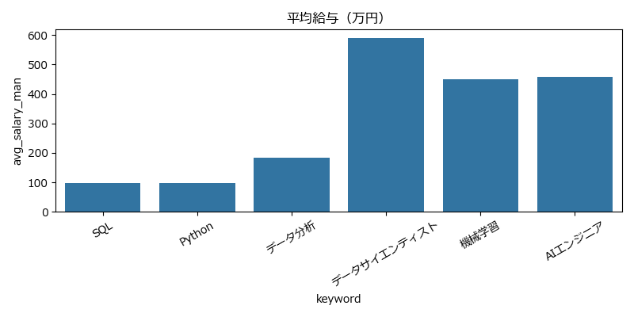
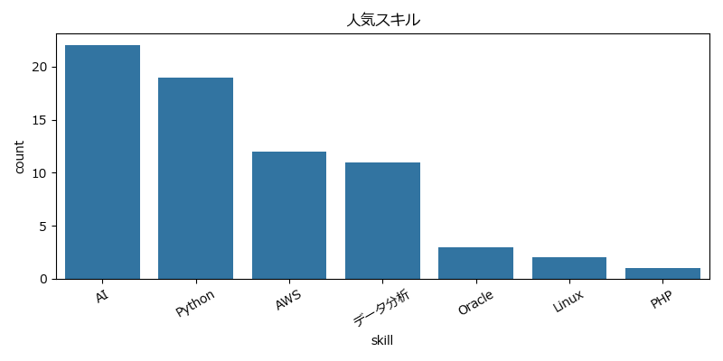

# 🚀 求人市場分析プラットフォーム  
### Job Market Intelligence Platform（Python × Flask × ETL × Data Engineering）

## 🔥 Highlights

- 求人データを活用したエンドツーエンドのデータ分析基盤を構築
- ETLパイプライン（取得→整形→保存→分析→可視化）を一貫実装
- スキル需要と給与の関係を定量的に分析
- Webダッシュボードとして可視化・即時確認が可能

👉 データ取得から意思決定支援までを一気通貫で実現したプロジェクト
---
## 📽️ デモ（Demo）

### 🎬 システム動作イメージ

以下は実際のダッシュボード操作のデモです：


---

### 🖼️ 補足スクリーンショット



---

### 💻 ローカル実行

```bash
git clone https://github.com/snowxxyg/it-job-analysis.git
cd job-market-analysis

pip install -r requirements.txt
python app.py
```

アクセス：
[http://127.0.0.1:5000](http://127.0.0.1:5000)

---

## 📌 概要（Overview）

本プロジェクトは、求人データを対象にした  
**データ収集・処理（ETL）・分析・可視化・Webアプリケーション化**を  
一貫して実装したデータ分析プラットフォームです。

スクレイピングにより取得した求人情報を、  
SQLデータベースに保存し、Pandasで分析、Matplotlibで可視化し、  
Flaskダッシュボードとして提供します。

---

## 🎯 目的（Purpose）

- IT求人市場のトレンド分析
- スキル需要の可視化
- 給与分布の把握
- データドリブンな意思決定支援

---

## 📊 分析レポート（Analysis Report）

本プロジェクトでは、求人サイトから取得したデータを基に、  
ITスキルごとの需要および給与水準の分析を行いました。

## 🆚 本プロジェクトの特徴（Differentiation）

一般的なスクレイピング・分析プロジェクトと異なり：

- データ取得だけでなく、分析・可視化・UIまで統合
- KPIベースでビジネス視点の分析を実施
- Webダッシュボードとして即利用可能な形で提供

👉 「分析して終わり」ではなく、「使える形まで落とし込む」ことを重視
---

### 🔍 分析内容

- キーワード別求人数の集計
- スキル別需要（Python / SQL / Data分析 / 機械学習など）
- 平均給与の算出
- スキルごとの給与比較

---

### 📈 主な分析結果（Key Findings）

#### 1. Pythonの需要が非常に高い
- Python関連求人は他スキルと比較して求人数が多い
- データ分析・機械学習領域で特に需要が集中

---

#### 2. Python + SQL の組み合わせが強い
- Python単体よりもSQLを組み合わせた求人の方が多い
- データエンジニア・データアナリスト職で高頻度

---

#### 3. 機械学習スキルは高給与傾向
- Machine Learning / AI関連求人は平均給与が高い
- ただし求人数はPython単体より少ない

---

#### 4. データ分析スキルは安定した需要
- Data Analysis / BI系スキルは継続的に需要あり
- 中〜高給与帯に分布

---

### 💡 考察（Insights）

- Pythonは「基礎スキル」として広く使われている
- SQLと組み合わせることで実務価値が上がる
- 高収入を狙う場合、機械学習やAI領域への拡張が有効
- データ分析分野は安定したキャリアパスとして有望

---

### 🎯 結論（Conclusion）

本分析から、以下のスキル戦略が有効と考えられる：

- Python + SQL → 実務対応力の強化
- Python + Data Analysis → 安定した需要
- Python + Machine Learning → 高収入領域

👉 特に「Pythonを軸に複数スキルを組み合わせる」ことが、  
市場価値向上において重要であると結論付けられる。


## 🧠 システムアーキテクチャ

```

[ Scraping Layer ]
↓
[ Data Storage (SQL) ]
↓
[ Data Processing (ETL / Pandas) ]
↓
[ Visualization (Matplotlib / Seaborn) ]
↓
[ Web Dashboard (Flask) ]

````

---

## 🤖 自動化（ETL Pipeline）

本システムは以下の処理を自動化：

1. Extract：求人データ取得（スクレイピング）
2. Transform：データ整形・クレンジング
3. Load：SQLデータベース保存
4. Analysis：KPI自動算出
5. Visualization：グラフ生成
6. Delivery：Webダッシュボード反映

---

## ⚙️ 自動更新機能

- `/update` にアクセスすることで  
  **データ取得 → 分析 → 可視化 → 表示更新** を一括実行

---

## ⏱️ バッチ処理

```bash
# cron例
0 9 * * * python main.py
````

---

## 🚀 主な機能

### 🕷️ データ収集

* 求人情報スクレイピング
* 複数ページ対応

### 🗄️ データ管理

* SQL保存
* 再利用可能なデータ設計

### 📊 データ分析

* 求人数
* 平均給与
* スキル分析

### 📈 KPI分析

* 総求人数
* 平均給与
* 人気スキル

### 📉 可視化

* 求人数グラフ
* 給与分布
* スキルランキング

### 🌐 Webダッシュボード

* Flask UI
* キーワード検索
* リアルタイム表示

---

## 📂 ディレクトリ構成

```
job-market-analysis/
│
├── app.py                      # Flask Webアプリのエントリーポイント
├── main.py                     # データパイプライン一括実行スクリプト
├── config.py                  # 設定管理（DB・パスなど）
├── requirements.txt           # 依存ライブラリ一覧
├── README.md                  # プロジェクト説明書（重要）
├── .gitignore                 # Git除外設定
│
├── crawler/                   # データ収集モジュール
│   ├── scraper.py             # 単一ページのスクレイピング処理
│   ├── crawler.py             # 複数ページのクロール制御
│   └── __init__.py
│
├── data/                      # データベース・データ管理
│   ├── db.py                  # MySQL接続・保存処理
│   └── __init__.py
│
├── analysis/                  # データ分析・可視化
│   ├── analysis.py           # データ集計・統計処理
│   ├── visualize.py          # グラフ生成（Matplotlib）
│   ├── report.py             # Excelレポート生成
│   └── __init__.py
│
├── templates/                # フロントエンド（Flask）
│   └── index.html
│
├── static/                   # 画像・グラフ出力
│   ├── job_count.png
│   ├── salary.png
│   └── skills.png
│
├── output/                   # 出力データ（Excelレポート）
│   └── report.xlsx
│
└── logs/                     # ログ管理（追加）
    └── app.log
```

---

## ⚙️ 技術スタック（Tech Stack）

### 🧩 言語

* Python
* SQL

### 🌐 Web / Backend

* Flask
* Jinja2

### 📊 データ分析

* Pandas
* NumPy

### 📈 可視化

* Matplotlib
* Seaborn

### 🕷️ スクレイピング

* Requests
* BeautifulSoup
* 正規表現

### 🗄️ データベース

* MySQL
* SQLクエリ設計

### 🔄 自動化 / ETL

* ETLパイプライン設計
* バッチ処理（main.py）
* スケジューリング対応

### 🖥️ システム

* OSファイル操作
* Logging

### 📦 出力

* Excelレポート

### 🧪 開発

* Git / GitHub
* モジュール設計

### ☁️ 拡張（予定）

* REST API
* Docker
* クラウドデプロイ

---

## 🧠 アーキテクチャ設計（Architecture Highlights）

### 🧩 レイヤー分離

* Crawler / Data / Analysis / Web を分離

### 🔄 ETL設計

* データ処理をパイプライン化

### ⚙️ 自動化

* ワンクリック更新 + バッチ処理

### 📊 KPI設計

* ビジネス指標に基づく分析

### 🔗 分離設計

* 分析ロジックとUIの独立

### 🧱 モジュール化

* 保守性・再利用性向上

### 📈 拡張性

* API / クラウド / 分散処理対応

---


## 💡 技術的なポイント

* ETLパイプライン設計
* データ分析 × Web統合
* KPIベース設計
* 自動化処理
* モジュール化設計

---

## 🔄 今後の改善

* REST API化
* 認証機能
* Docker対応
* AWS / GCPデプロイ
* リアルタイム更新

---

## 🎯 想定用途

* HR分析
* 転職市場分析
* データ分析ポートフォリオ

---


## 求人データの収集から分析・可視化・ダッシュボード化までを一貫して実装し、  
## スキル需要と給与の関係を定量的に分析できるシステムを構築しました。

---
## 作者

snowxxyg

---
